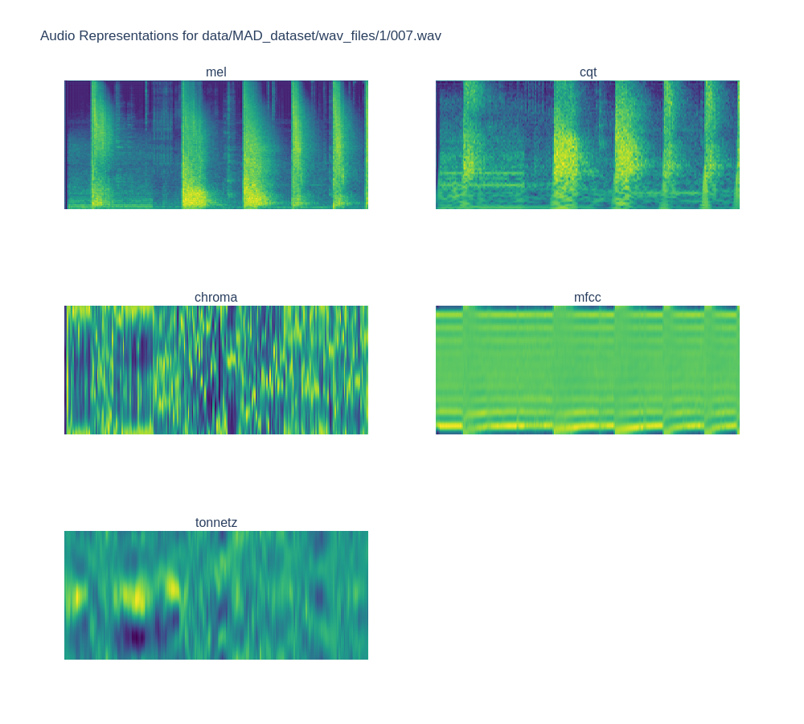

# 🎧 Military Audio Dataset Handling

Explore the auditory landscape of warfare with this repository. It provides scripts and methods for handling a military audio dataset, transforming raw YouTube audio into mel spectrograms for classification. Categories range from gunshots to helicopters, capturing diverse audio events.

This repository is forked from [kaen2891's military_audio_dataset](https://github.com/kaen2891/military_audio_dataset). A big thanks to kaen2891 for their great effort in establishing the foundation. This repository serves as an extension, focusing on enhancing the data handling aspect of the project.


## 🎯 Dataset Overview

This audio battlefield is divided into these epic categories:

- 0: Communication (Roger that!)
- 1: Gunshot (Pew pew!)
- 2: Footsteps (Shhh... they're coming)
- 3: Shelling (Boom!)
- 4: Vehicle (Vroom vroom)
- 5: Helicopter (Get to the chopper!)
- 6: Fighter (Danger zone!)

Each spectrogram captures 10 seconds of audio action.

## 🚀 Features

- YouTube audio downloader (because who doesn't love a good video-to-audio heist?)
- Audio transformation playground (turn those boring waveforms into fancy spectrograms)
- Mel spectrogram generator (making audio look cool since 2023)
- Spectrogram filter (only the best pixels make it through)

## 🛠️ Getting Started

1. Clone this bad boy:
   ```sh
   git clone https://github.com/masud1901/military_audio_dataset_dataset_handling.git
   cd military_audio_dataset_dataset_handling
   ```

2. Install the goods:
   ```sh
   pip install -r requirements.txt
   ```

3. Download some audio:
   ```sh
   python scripts/youtube_audio_download.py
   ```

4. Check out your loot:
   ```sh
   python scripts/check_images.py
   ```

5. Transform audio into visual eye candy:
   ```sh
   python scripts/mel_spectogram_conversion.py
   ```

6. Filter out the weak:
   ```sh
   python scripts/filter_spectrograms.py
   ```

## 📊 The Science Bit

We tested various audio transformations to find the perfect spectrogram recipe. Check out this beauty:



And here's what you'll end up with after all the hard work:


## 🤝 Contributing

Got ideas? We love ideas! Feel free to submit a pull request or open an issue. Let's make this audio dataset handler the best it can be!

## 📜 License

This project is licensed under the MIT License. Use it, abuse it, just don't refuse it.

## 🎉 Fun Fact

Did you know? The human ear can distinguish between almost half a million different sounds. Our dataset only covers a fraction of that, but hey, it's a start!

Happy audio analyzing, and may the spectrograms be ever in your favor!